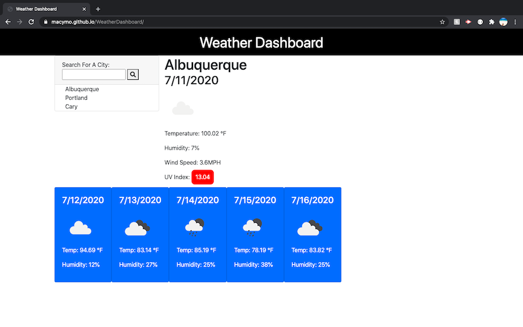

# WeatherDashboard

## Description
A weather dashboard that is responsive, runs in the browser, and features dynamically updated HTML and CSS. Uses OpenWeatherAPI.

## Table of Contents

* [Contributing](#contributing)
* [Questions](#questions)

## Contributing
Contact Me

## Questions
Macymo

